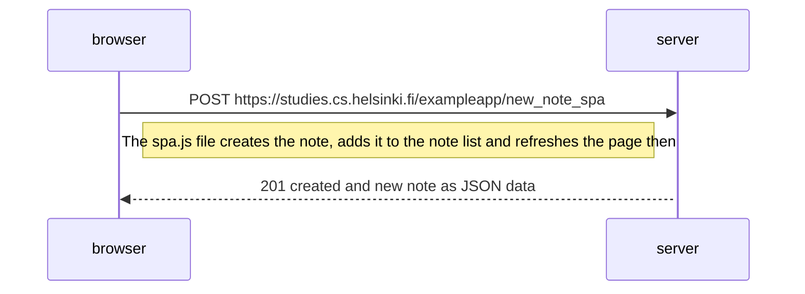

```mermaid
sequenceDiagram
    participant browser
    participant server

    browser->>server: POST https://studies.cs.helsinki.fi/exampleapp/new_note_spa
    activate server

 Note right of browser: The spa.js file creates the note, adds it to the note list and refreshes the page then 

    server-->>browser: 201 created and new note as JSON data
```