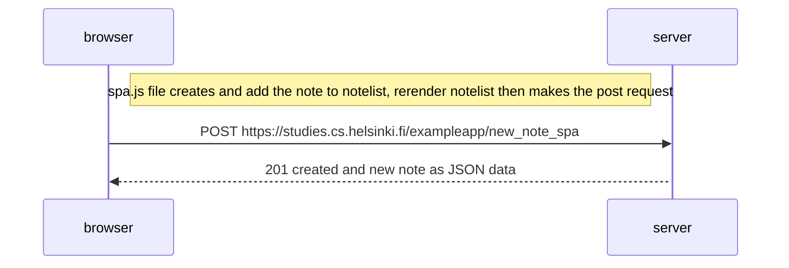

```mermaid
sequenceDiagram
    participant browser
    participant server


 Note right of browser: spa.js file creates and add the note to notelist, rerender notelist then makes the post request

    browser->>server: POST https://studies.cs.helsinki.fi/exampleapp/new_note_spa
    activate server

    server-->>browser: 201 created and new note as JSON data
```